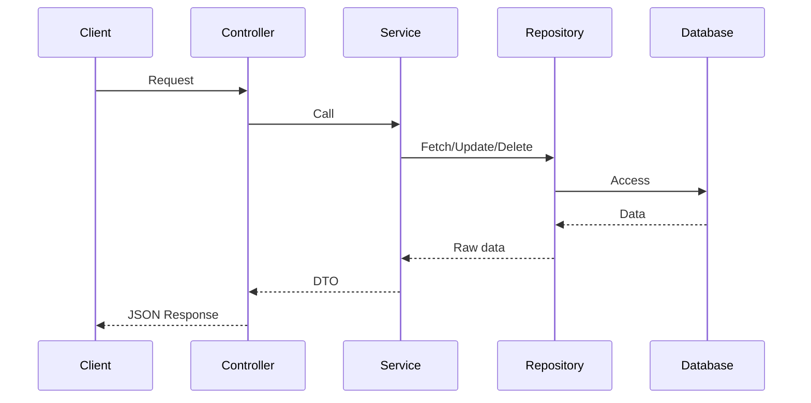

# Estate

Une application web pour gérer, consulter et modifier des annonces immobilières.

## Lancer le Projet

### Prérequis
- Node.js 18+ 
- Docker & Docker Compose (optionnel)
- npm ou yarn

### Installation Locale

**1. Backend**
```bash
cd backend
npm install
npm run dev
```
Le serveur démarre sur `http://localhost:3000`

**2. Frontend**
```bash
cd frontend
cp .env.example .env 
npm install
npm start
```
Vous pouvez modifier le fichier `.env` avec vos propres valeurs:
```
# where the frontend runs
PORT=3900
# backend API URL
REACT_APP_BACKEND_API_URL=http://localhost:3000
```

L'application démarre sur `http://localhost:3900`

### Avec Docker Compose

```bash
docker-compose up -d --build
```

Frontend: `http://localhost:3900`  
Backend: `http://localhost:3000`


## Architecture Choisie

### Backend - Architecture en Couches
```
└── src
    ├── app.ts            # Configuration de l'application Express
    ├── server.ts         # Point d'entrée - démarrage du serveur
    ├── config/           # Contient des config (vide actuellement)
    ├── controllers/      # Gestion des requêtes/réponses HTTP
    │   └── properties.controller.ts
    ├── dtos/             # Objets de transfert de données (validation/sérialisation)
    │   └── property.dto.ts
    ├── middlewares/      # Intercepteurs de requêtes (vide actuellement)
    ├── models/           # Représentation des données métier
    │   └── property.model.ts
    ├── repositories/     # Abstraction d'accès aux données
    │   └── properties.repository.ts
    ├── routes/           # Définition des routes API
    │   └── properties.routes.ts
    ├── schemas/          # Schémas de validation (Zod)
    │   └── property.schema.ts
    ├── services/         # Logique métier et orchestration
    │   └── properties.service.ts
    └── types/            # Contient des interfaces
        └── property.types.ts
```

### Diagramme de séquence


**Pourquoi j'ai choisi cette architecture backend :**

| Couche | Responsabilité | Avantage |
|--------|---------------|----------|
| **Routes** | Définition des endpoints API | Séparation claire des routes, facilité d'organisation RESTful |
| **Controllers** | Gestion des requêtes HTTP | Validation initiale, formatage des réponses, gestion d'erreurs HTTP |
| **Services** | Logique métier | Centralise la logique business, indépendante du framework web |
| **Repositories** | Accès aux données | Abstraction de la source de données (peut changer de DB sans affecter les services) |
| **Models** | Représentation des entités | Définition claire de la structure des données métier |
| **DTOs** | Transfert de données | Sérialisation, validation, sécurité (masquage des champs sensibles) |
| **Schemas** | Validation | Validation centralisée et réutilisable des données d'entrée |

**Motivation principale** : J'ai adopté une architecture inspirée des bonnes pratiques Java (N-Tier) adaptée à Express Js. Cette approche offre :
- **Responsabilité unique** : Chaque couche a un rôle précis
- **Testabilité** : Isolation des composants facilitant les tests unitaires
- **Maintenabilité** : Changements localisés, couplage faible
- **Évolutivité** : Ajout facile de nouvelles fonctionnalités sans refactorisation majeure

### Frontend - Architecture Modulaire par Fonctionnalité
```
└── src/
    ├── App.tsx           # Composant racine et routage principal
    ├── index.tsx         # Point d'entrée React
    ├── index.css         # Styles globaux
    ├── components/       # Composants réutilisables UI
    │   ├── PropertyCard.tsx    # Carte de propriété
    │   └── PropertyForm.tsx    # Formulaire de propriété
    ├── pages/            # Composants de pages complètes
    │   ├── Properties.tsx           # Liste des propriétés
    │   ├── PropertyDetails.tsx      # Détails d'une propriété
    │   └── PropertyFormPage.tsx     # Page de formulaire
    ├── services/         # Communication avec l'API
    │   ├── apiClient.ts        # Client HTTP configuré (Axios)
    │   └── propertyService.ts  # Fonctions spécifiques aux propriétés
    ├── types/            # Types TypeScript partagés
    │   └── property.types.ts   # Interface property
    ├── hooks/            # Hooks React personnalisés
    │   └── useFormHandler.ts   # Gestion de formulaire réutilisable
    └── utils/            # Fonctions utilitaires
        └── apiErrorHandler.ts  # Gestion centralisée des erreurs API
```

**Pourquoi j'ai choisi cette architecture frontend :**

| Dossier | But | Exemple d'usage |
|---------|-----|-----------------|
| **components/** | Composants UI réutilisables | `PropertyCard` utilisée dans plusieurs pages |
| **pages/** | Pages complètes de l'application | Chaque route correspond à une page |
| **services/** | Logique de communication API | Abstraction des appels HTTP, gestion des tokens |
| **hooks/** | Logique réutilisable React | `useFormHandler` pour gérer plusieurs formulaires |
| **types/** | Définitions TypeScript | Interface `Property` partagée front/back |
| **utils/** | Fonctions utilitaires | Formateurs, validateurs, helpers |

**Avantages de cette organisation :**
1. **Séparation claire des responsabilités** : UI, logique métier et état sont découplés
2. **Réutilisabilité maximale** : Composants et hooks utilisables dans tout l'app
3. **Évolutivité facile** : Ajout de pages sans affecter l'existant
4. **Maintenance simplifiée** : Chaque fichier a une responsabilité unique
5. **Testabilité améliorée** : Services et hooks testables indépendamment des composants UI

## Améliorations Possibles avec Plus de Temps

### Backend

1. **Base de données relationnelle** :
   ```typescript
   // Models étendus
   User {
    id: number
    email: string
    password: string
    properties: Property[] // Relation One-to-Many
   }
   
   Property {
    id: string;
    title: string;
    city: string;
    price: number;
    surface: number;
    description?: string;
    userId: number // Clé étrangère
    user: User // Relation Many-to-One
   }
   ```
- Ajout d'un ORM (Prisma)

2. **Testing** : Ajout des tets unitaires et d'intégration avec **Jest**

3. **Documentation** : Swagger pour l'API

### Frontend
1. **Améliorations UI/UX** : Responsive design complet

2. **Structure évoluée** :
```
src/
├── features/          # Organisation par fonctionnalité
│   └── properties/
│       ├── components/
│       ├── hooks/
│       └── types/
├── shared/            # Éléments partagés
└── ├── ui/            # Buttons, Headings...
    ├── utils/
    └── constants/
```

### Développement

1. **CI/CD** : Pour déployer automatiquement l’application et visualiser clairement son fonctionnement dans un environnement de production.

2. **Logs** : visualiser tous requêtes vers le backend


